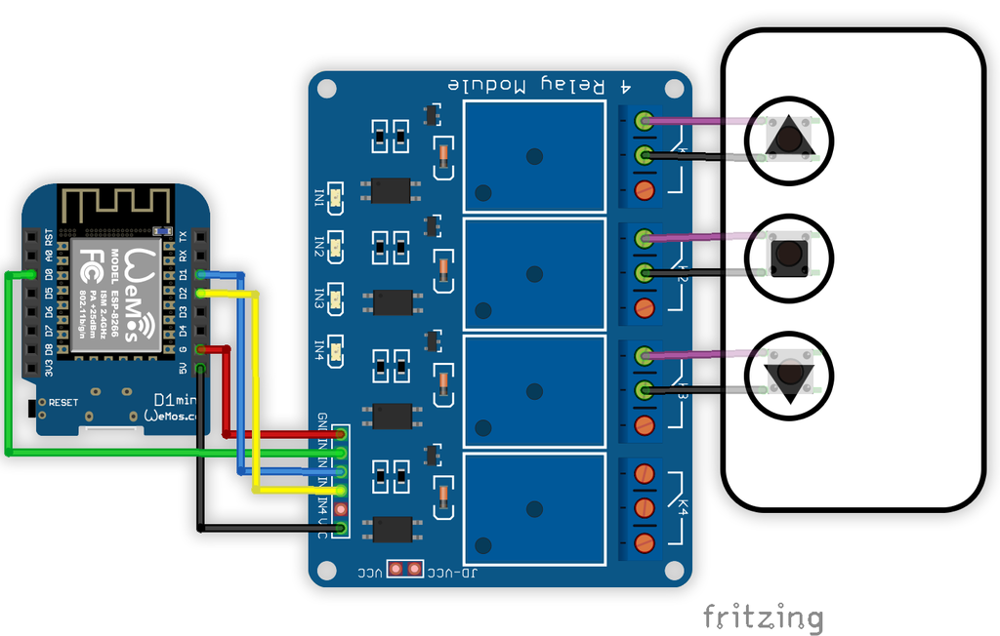

# BeGarage
#### 3 ways relay controller through ESP32/8266
--------
**Device Requirement**
- Chip module base on ESP32 or ESP8266
- 3/4 ways relay module

**Software Requirement**
- Downlad & install [Arduino IDE](https://www.arduino.cc/en/Main/Software) 
https://www.arduino.cc/en/Main/Software

- Arduino code for ESP32 
https://github.com/espressif/arduino-esp32  

- Arduino code for ESP8266 
https://github.com/esp8266/Arduino

***Arduino code library*** 
- MQTT:
[knolleary/pubsubclient](https://github.com/knolleary/pubsubclient)
- WebServer:
[me-no-dev/ESPAsyncWebServer](https://github.com/me-no-dev/ESPAsyncWebServer) 
Async TCP Library for ESP8266: [me-no-dev/ESPAsyncTCP](https://github.com/me-no-dev/ESPAsyncTCP) 
Async TCP Library for ESP32: [me-no-dev/AsyncTCP](https://github.com/me-no-dev/AsyncTCP) 
- WifiManager:
[tzapu/WiFiManager](https://github.com/tzapu/WiFiManager)

**Fritzing wiring diagram**
 

**Upload ``BeGarage/data`` to SPIFFS** 
Files in ``BeGarage/data`` could be upload to SPIFF space of ESP32/ESP8266. See [BeGarage/data/README.md](BeGarage/data/) for more detail.
